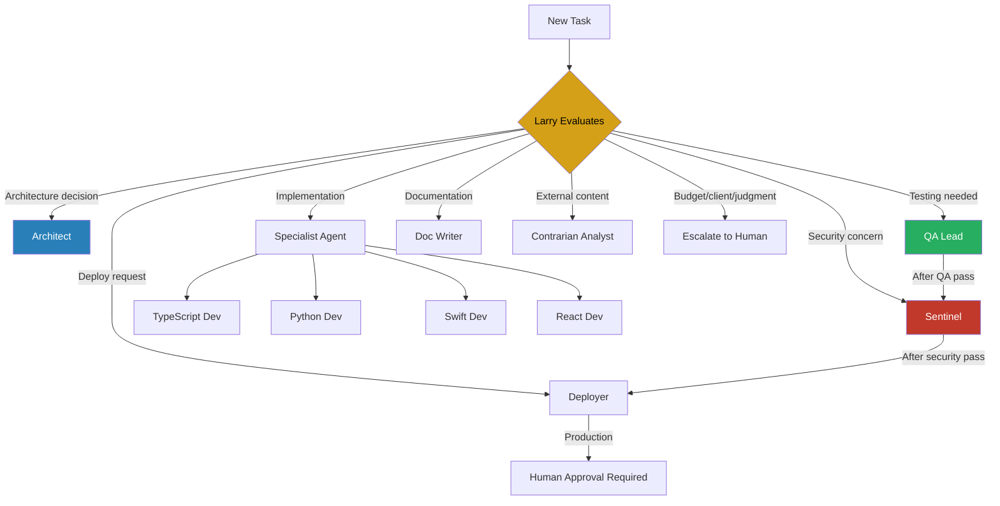

# Agent Roster

The environment implements Anthropic's Orchestrator-Worker pattern with 12 agents: 1 orchestrator and 11 specialists.

## Cost Strategy

Opus is used for high-judgment tasks (orchestration, architecture, analysis). Sonnet is used for execution tasks (implementation, testing, deployment, documentation). Anthropic's multi-agent research found systems use approximately 15x more tokens than single-agent interactions — this tiering manages cost without sacrificing quality where judgment matters.

## Complete Roster

| Agent | Model | Role | Memory | Details |
|-------|-------|------|--------|---------|
| **Larry** | Opus | Orchestrator — task decomposition, delegation, synthesis | User | [Details](larry.md) |
| **Architect** | Opus | Architecture design, ADRs, technical evaluation | Project | [Details](architect.md) |
| **Sentinel** | Sonnet | Security scanning, compliance, RSP enforcement | Project | [Details](sentinel.md) |
| **QA Lead** | Sonnet | Testing strategy, quality gates, coverage | Project | [Details](specialists.md#qa-lead) |
| **Deployer** | Sonnet | Build, deploy, CI/CD management | Project | [Details](specialists.md#deployer) |
| **Doc Writer** | Sonnet | Documentation, help content, visual aids | Project | [Details](specialists.md#doc-writer) |
| **Analyst** | Opus | Contrarian analysis of external knowledge | User | [Details](specialists.md#contrarian-analyst) |
| **Guide** | Sonnet | Help agent for framework questions | Project | [Details](specialists.md#guide) |
| **TypeScript Dev** | Sonnet | TypeScript/JavaScript specialist | Project | [Details](specialists.md#typescript-dev) |
| **Python Dev** | Sonnet | Python/AI/ML specialist | Project | [Details](specialists.md#python-dev) |
| **Swift Dev** | Sonnet | Swift/iOS/macOS specialist | Project | [Details](specialists.md#swift-dev) |
| **React Dev** | Sonnet | React/frontend specialist | Project | [Details](specialists.md#react-dev) |

## Delegation Flow

## Key Constraint

!!! warning "Anthropic Constraint"
    Subagents cannot spawn other subagents. Larry delegates directly to all workers. If a task requires chaining (e.g., Architect produces a plan, then developers implement it), Larry orchestrates that sequence explicitly.
