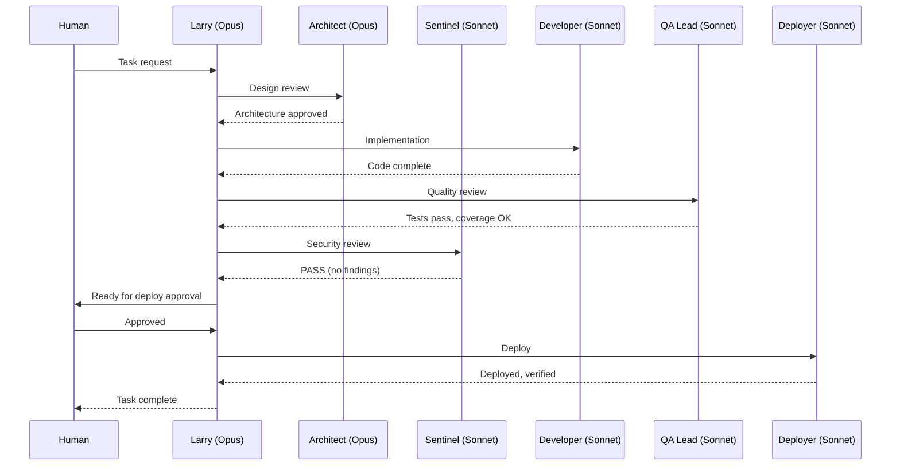
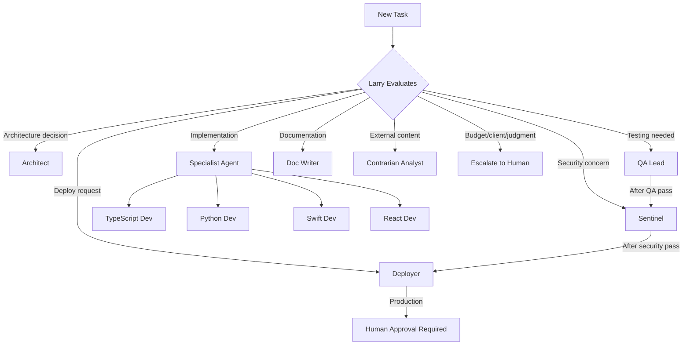

# Agent Architecture

## Orchestrator-Worker Pattern

The environment implements Anthropic's Orchestrator-Worker pattern with Larry as the central orchestrator delegating to 11 specialist agents.

## Agent Roster

| Agent | Model | Role | Memory |
|-------|-------|------|--------|
| **larry** | Opus | Orchestrator — task decomposition, delegation, synthesis | User |
| **architect** | Opus | Architecture design, ADRs, technical evaluation | Project |
| **sentinel** | Sonnet | Security scanning, compliance, RSP enforcement | Project |
| **qa-lead** | Sonnet | Testing strategy, quality gates, coverage | Project |
| **deployer** | Sonnet | Build, deploy, CI/CD management | Project |
| **doc-writer** | Sonnet | Documentation, help content, visual aids | Project |
| **analyst** | Opus | Contrarian analysis of external knowledge | User |
| **guide** | Sonnet | Help agent for framework questions | Project |
| **typescript-dev** | Sonnet | TypeScript/JavaScript specialist | Project |
| **python-dev** | Sonnet | Python/AI/ML specialist | Project |
| **swift-dev** | Sonnet | Swift/iOS/macOS specialist | Project |
| **react-dev** | Sonnet | React/frontend specialist | Project |

## Delegation Rules

## Cost Strategy

Opus is used for high-judgment tasks (orchestration, architecture, analysis). Sonnet is used for execution tasks (implementation, testing, deployment, documentation). This balances quality with cost — Anthropic's multi-agent research found systems use approximately 15x more tokens than single-agent interactions.
