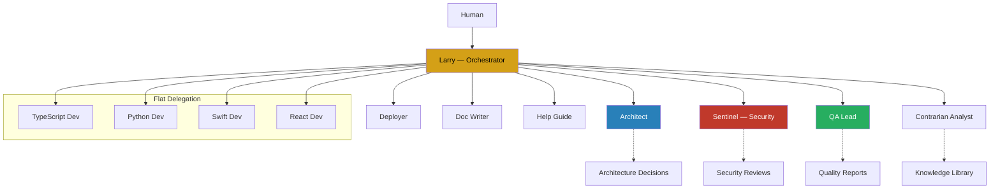

# System Overview

## Anthropic's Five Production-Tested Patterns

Per Anthropic's "Building Effective Agents" paper, these are the validated patterns in order of complexity:

| Pattern | Use When | Our Application |
|---------|----------|-----------------|
| Prompt Chaining | Sequential tasks with validation gates | Build pipelines, deployment workflows |
| Routing | Input classification to specialized handlers | Project type detection, language routing |
| Parallelization | Independent subtasks that can run simultaneously | Multi-file code review, test execution |
| Orchestrator-Workers | Dynamic task decomposition | Primary development workflow (Larry) |
| Evaluator-Optimizer | Iterative refinement with feedback loops | QA cycles, documentation review |

## System Architecture



!!! warning "Anthropic Constraint"
    Subagents cannot spawn other subagents. Larry delegates directly to all workers. If a task requires chaining (e.g., Architect produces a plan, then developers implement it), Larry orchestrates that sequence explicitly.

## Installation Mapping

On each Mac, the framework root maps to the user's home directory via symlinks:

```
~/agentic-dev/                  → Git repository (primary sync)
~/.claude/CLAUDE.md             → Symlink to ~/agentic-dev/CLAUDE.md
~/.claude/agents/               → Symlink to ~/agentic-dev/agents/
~/.claude/skills/               → Symlink to ~/agentic-dev/skills/
```

This ensures Claude Code discovers the framework's agents and skills globally via Anthropic's documented resolution order.

## Per-Project Structure

Each project follows a consistent structure that works across Claude Code, Cowork, and Chat contexts:

```
project-root/
├── CLAUDE.md                    # Project-specific instructions
├── CLAUDE.local.md              # Machine-specific overrides (.gitignored)
├── .claude/
│   ├── settings.json            # Project settings (shared)
│   ├── settings.local.json      # Local settings (.gitignored)
│   ├── agents/                  # Project-specific subagents
│   ├── skills/                  # Project-specific skills
│   ├── rules/                   # Path-scoped rules
│   └── hooks/
│       └── hooks.json           # Lifecycle hooks
├── src/
├── tests/
└── docs/
```
