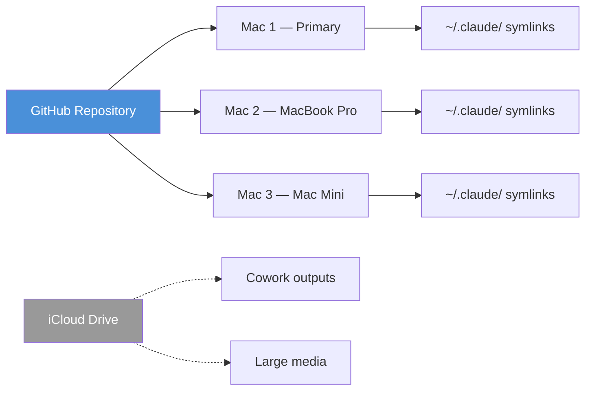

# Overview

## Design Principles

These principles are drawn directly from Anthropic's "Building Effective Agents" research and Claude Code best practices documentation:

1. **Simplicity First** — Start with the simplest solution possible. Add complexity only when measured performance gains justify it.
2. **Context is the Scarce Resource** — Claude's context window fills up fast. Every design decision should minimize unnecessary context consumption.
3. **Transparency** — Explicitly surface agent planning steps. The human must always understand what agents are doing and why.
4. **Verification Over Trust** — Include tests, screenshots, or expected outputs so Claude can check itself.
5. **Agent-Computer Interface (ACI)** — Invest in tool documentation and testing equivalent to human-computer interface efforts.

## Framework Structure

```
~/agentic-dev/
├── CLAUDE.md              # Global instructions for all Claude sessions
├── agents/                # 12 agent definitions (orchestrator + specialists)
├── skills/                # 6 skill definitions (including 2 self-improving)
├── templates/             # Project templates (fullstack-web, ios-app, ai-ml)
├── framework/
│   ├── architecture/      # ADRs and system design docs
│   └── standards/         # All governance and coding standards
├── knowledge-library/     # Curated external knowledge and assessments
├── security/              # Security profiles and policies
├── cowork-projects/       # Non-code project workspace
└── docs/                  # This documentation site
```

## Cross-Machine Sync

The framework synchronizes across 3+ Apple Silicon Macs using Git as the primary sync mechanism. Symlinks map the framework to `~/.claude/` for automatic Claude Code discovery.



| Content | Sync Method | Location |
|---------|------------|----------|
| Framework (agents, skills, standards) | Git | `~/agentic-dev/` |
| Project code | Git (per-project repos) | `~/projects/[name]/` |
| Cowork outputs | iCloud | `~/agentic-cowork/` |
| Machine-specific settings | Not synced | `CLAUDE.local.md` |
| Client-confidential files | Git only | Project repos (never iCloud) |
