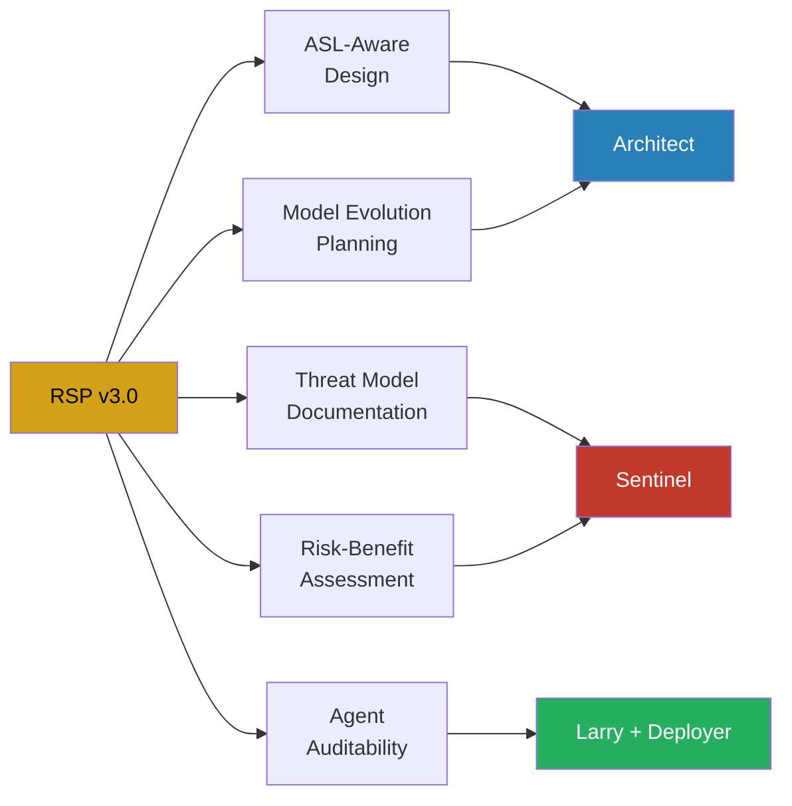
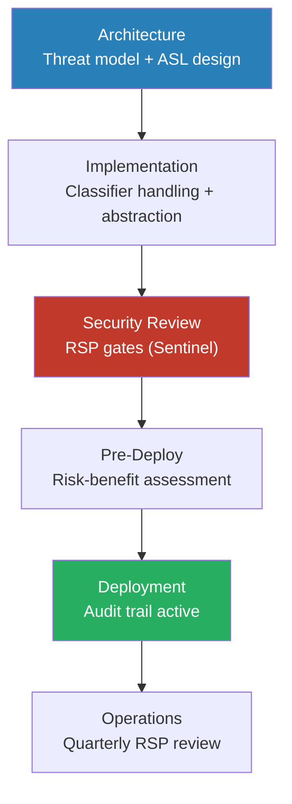

# RSP v3.0 Alignment

**ADR:** [ADR-005](../architecture/decisions/ADR-005-rsp-v3-integration.md) | **Source:** [Anthropic RSP v3.0](https://anthropic.com/responsible-scaling-policy/rsp-v3-0) (February 24, 2026)

## Why RSP Integration Matters

This development environment builds directly on Anthropic's Claude models. The Responsible Scaling Policy v3.0 is not a reference document — it establishes the operating parameters for the models we build on. Ignoring it means building on assumptions that Anthropic may change at any time.

## Adopted Principles

Five principles from RSP v3.0 are adopted as framework requirements:

### 1. ASL-Aware Design

Systems must account for Anthropic's active AI Safety Level safeguards (currently ASL-3). Design for safety classifier compatibility — never architect around safeguards. Constitutional Classifiers, content filtering, and access controls are inherited protections, not obstacles.

**Owner:** Architect

### 2. Threat Model Documentation

Every AI-powered feature requires a documented threat model before design approval. The threat model must identify risks specific to the AI component, mitigations in place, and accepted residual risk.

**Owner:** Sentinel (blocking gate)

### 3. Risk-Benefit Assessment

Following Anthropic's own framework: "are the identified risks justified by corresponding benefits?" This is a deployment gate, not a recommendation. Production deployment is blocked without this documentation.

**Owner:** Sentinel (blocking gate)

### 4. Agent Auditability

Multi-agent architectures must include logging of all delegations, decisions, and outcomes. This is a governance requirement aligned with Anthropic's "eyes on everything" principle for AI development activities.

**Owner:** Larry (orchestrator) + Deployer

### 5. Model Evolution Planning

Anthropic's RSP is a living document and safeguards escalate. Architecture must include abstraction layers for model API calls and graceful degradation when model behavior changes. Anthropic publishes Risk Reports every 3-6 months that may affect downstream systems.

**Owner:** Architect

## Items Under Consideration

| Item | Status | Notes |
|------|--------|-------|
| RAND SL4 security benchmark | Referenced, not mandated | Potential alignment for enterprise clients with elevated security requirements |
| Noncompliance reporting mechanisms | Client advisory | Guidance for enterprise clients on Anthropic's reporting obligations, not framework enforcement |

## Lifecycle Integration

The RSP is not applied at a single checkpoint. Its principles influence architecture decisions, implementation patterns, security review criteria, deployment gates, and ongoing operational monitoring. See the [Security Baseline](security-baseline.md) for the complete lifecycle touchpoints table.

## Quarterly Review Cycle

Anthropic publishes Risk Reports every 3-6 months. The framework includes a scheduled quarterly review to assess:

- Changes to active AI Safety Level (currently ASL-3)
- New or modified safeguards that affect application behavior
- Capability threshold changes that may trigger ASL escalation
- Updates to the Frontier Safety Roadmap
- Implications for existing threat models and risk assessments

## Source Assessment

Full Contrarian Analyst assessment with claim-by-claim evaluation: `knowledge-library/assessments/2026-03-29-anthropic-rsp-v3-framework-implications.md`
