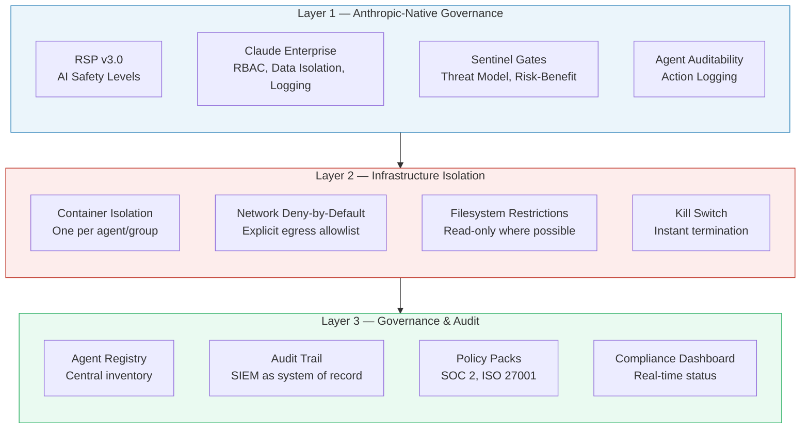
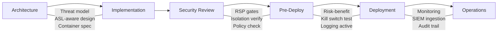

# Safe AI Governance

**ADR:** [ADR-006](../architecture/decisions/ADR-006-safe-ai-governance.md) | **Compliance Target:** SOC 2 Type II + ISO 27001

## Governing Principle

AI agents that take real-world actions require governance at three levels: model-level controls (what the AI is allowed to do), infrastructure-level isolation (what the AI is physically capable of doing), and audit-level evidence (proof that controls are working). Policy without enforcement is documentation. Enforcement without audit is trust. Enterprise clients require all three.

## Three-Layer Architecture



### Layer 1 — Anthropic-Native Governance (Operational)

Controls provided by Anthropic's platform and enforced by our framework:

| Control | Source | Enforced By |
|---------|--------|-------------|
| AI Safety Level safeguards (ASL-3) | Anthropic RSP v3.0 | Anthropic (inherited) |
| Data isolation | Claude Enterprise | Anthropic |
| RBAC and access policies | Claude Enterprise | Admin configuration |
| Usage logging | Claude Enterprise | Anthropic + SIEM |
| Threat model documentation | Framework (ADR-005) | Architect + Sentinel |
| Risk-benefit assessment | Framework (ADR-005) | Sentinel (blocking gate) |
| Agent auditability | Framework (ADR-005) | Larry + Deployer |

**Status:** Operational.

### Layer 2 — Infrastructure Isolation (Standard Defined)

Controls enforced by infrastructure, independent of model behavior:

| Control | Pattern | Implementation |
|---------|---------|----------------|
| Agent process isolation | One container per agent | Docker / Kubernetes |
| Network deny-by-default | No outbound unless allowed | NetworkPolicy |
| Egress allowlisting | Declared per agent | YAML policy |
| Filesystem restrictions | Designated directories only | Volume mounts |
| Resource limits | CPU/memory caps | Resource quotas |
| Kill switch | Instant termination | Container lifecycle |

**Example egress policy:**

```yaml
agent: architecture-review
network:
  egress:
    allow:
      - api.anthropic.com:443
      - github.com:443
    deny: all
filesystem:
  read:
    - /app/project/
    - /app/framework/standards/
  write:
    - /app/output/
  deny: all
resources:
  cpu: "1"
  memory: "2Gi"
```

**Status:** Standard defined. Implementation required for production agent deployments.

### Layer 3 — Governance Platform & Audit (Evaluation Pending)

| Capability | Purpose | Candidates |
|-----------|---------|------------|
| Agent registry | Central inventory of all agents | Credo AI, AgentID, or internal |
| Policy packs | Compliance policy sets mapped to controls | Governance platform |
| Audit trail | Evidence-quality immutable logs | SIEM (primary) |
| Compliance dashboard | Real-time status for auditors | Governance platform |

**Status:** Evaluation scheduled.

## SOC 2 + ISO 27001 Control Mapping

| SOC 2 Trust Criteria | ISO 27001 Control | How We Address It |
|---------------------|-------------------|-------------------|
| CC6.1 — Logical access | A.9 Access control | L1: RBAC + L2: Network policies |
| CC6.3 — System boundaries | A.13 Communications security | L2: Container isolation, egress |
| CC7.1 — System monitoring | A.12 Operations security | L1: Logging + L2: SIEM |
| CC7.2 — Anomaly detection | A.16 Incident management | L2: Monitoring + L1: Sentinel |
| CC8.1 — Change management | A.14 System development | L1: Git workflow, PR reviews |
| CC9.1 — Risk mitigation | A.18 Compliance | L1: RSP gates + L3: Dashboard |

## Development Lifecycle Integration



| Phase | Layer 1 | Layer 2 | Layer 3 |
|-------|---------|---------|---------|
| Architecture | Threat model, ASL design | Container/namespace spec | Registry entry |
| Implementation | Classifier handling | Sandbox config, egress list | Policy assignment |
| Security Review | RSP gates (Sentinel) | Isolation verification | Governance check |
| Pre-Deployment | Risk-benefit assessment | Restrictions active, kill switch tested | Status: pending |
| Deployment | Logging active | Monitoring confirmed | Status: active |
| Operations | Quarterly RSP review | Anomaly detection | Audit reporting |
| Incident | Sentinel alert | Container termination | Status: suspended |

## Design-for-Exit Principles

1. **Business logic is framework-neutral.** Agents call internal APIs, not vendor-specific SDKs.
2. **Security policies are configuration, not code.** Changing enforcement engines does not require rewriting agents.
3. **Observability is centralized outside any vendor.** SIEM is the system of record.
4. **Standards-based interfaces.** MCP for tools, provider-agnostic abstraction for model calls.
