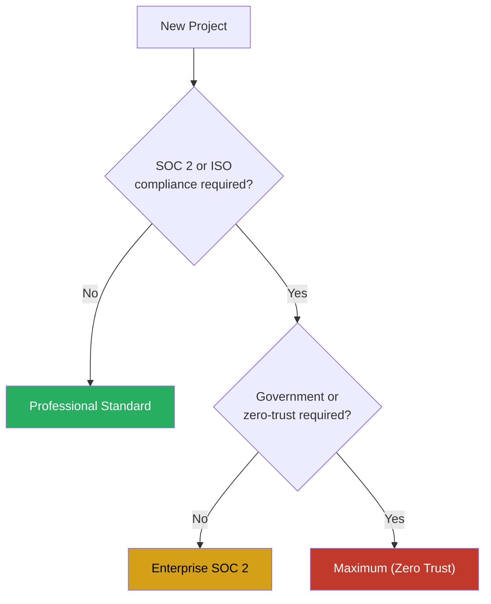

# Security Profiles

The framework provides three security profiles of increasing strictness. Every project uses the Professional Standard profile by default. Stricter profiles are activated based on client requirements.

## Profile Selection

## Professional Standard (Default)

**Use When:** All projects unless a stricter profile is specified.

| Control | Setting |
|---------|---------|
| Secrets in code | Blocked (pre-commit hook + Sentinel scan) |
| .env in .gitignore | Required (verified by Sentinel) |
| Dependency audit | Required before merge |
| Branch protection | main + develop (PR required, 1 approval, CI pass) |
| iCloud for client data | Prohibited (ADP is off) |
| Production deploy gate | Human approval + QA + Sentinel sign-off |
| Credential rotation | Quarterly recommendation |
| Code signing | Recommended for releases; required for iOS/macOS |

**Sentinel Requirements:** Full codebase scan before first deployment. Incremental scan (changed files) before each PR merge. Weekly dependency audit.

## Enterprise SOC 2

**Use When:** Client engagements with SOC 2 compliance requirements.

Includes all Professional Standard controls, plus:

| Control | Setting |
|---------|---------|
| Access logging | All system access logged |
| Encryption at rest | All data stores, all environments |
| Encryption in transit | TLS 1.2+ required, no exceptions |
| Multi-factor auth | All service accounts and human access |
| Dependency pinning | Exact versions required (no floating versions) |
| Vulnerability SLA | Critical: 24h, High: 7d, Medium: 30d |
| Audit trail | Git history + CI logs retained (minimum 1 year) |
| Data retention policy | Per client contract |
| Penetration testing | Annual minimum |
| Incident response plan | Required before first deployment |

**Additional Sentinel Requirements:** Full dependency tree audit (including transitive). SAST in CI pipeline. Container image scanning. Quarterly access review.

## Maximum (Zero Trust)

**Use When:** Government, regulated industries, or any engagement requiring zero-trust posture.

Includes all Enterprise SOC 2 controls, plus:

| Control | Setting |
|---------|---------|
| iCloud sync | Fully prohibited (no project data in any cloud sync) |
| Network access | Allowlist only (explicit approval per service) |
| Code review | 2 approvals required (1 security-qualified) |
| Secrets management | Vault required (HashiCorp Vault or equivalent) |
| Container hardening | Distroless base images |
| Supply chain security | SBOM required for all releases |
| Data classification | Per-field classification |
| Logging | Immutable, tamper-evident audit logs |
| Session management | Short-lived tokens only (1 hour max) |
| CI/CD security | Signed commits required (GPG) |

**Additional Sentinel Requirements:** DAST before each release. Infrastructure-as-code scanning. Runtime security monitoring. Signed artifact verification.

## Profile Comparison Matrix

| Control Area | Professional | Enterprise SOC 2 | Maximum |
|-------------|-------------|-------------------|---------|
| Secrets management | Env vars | Env vars | Vault required |
| Encryption in transit | Recommended | TLS 1.2+ required | TLS 1.2+ required |
| Encryption at rest | Recommended | Required | Required |
| Access logging | Optional | Required | Required + immutable |
| Code review | 1 approval | 1 approval | 2 approvals |
| Dependency management | Audit before merge | Exact version pinning | Pinning + SBOM |
| Network policy | Standard | Standard | Allowlist only |
| Container security | Standard | Image scanning | Distroless + hardened |
