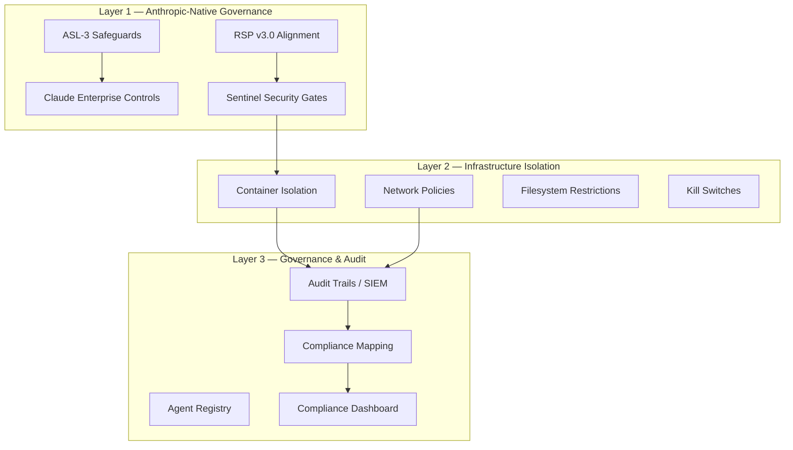

# Agentic Development Environment

A production-grade AI agent governance framework built on Anthropic's Claude, designed for cross-machine synchronization across Apple Silicon Macs.

## What This Is

This framework provides the complete infrastructure for building, governing, and deploying AI-powered applications with enterprise-grade security, compliance, and auditability. It implements Anthropic's documented best practices as the primary standard and extends them with a three-layer safe AI governance model targeting SOC 2 and ISO 27001 compliance.

## Core Architecture

## Framework Components

| Component | Count | Purpose |
|-----------|-------|---------|
| **Agents** | 12 | Orchestrator-Worker architecture with specialized roles |
| **Skills** | 6 | Reusable capabilities including 2 self-improving pilots |
| **Standards** | 8 | Code, testing, security, governance, and documentation |
| **ADRs** | 6 | Formal architecture decision records |
| **Security Profiles** | 3 | Professional, Enterprise SOC 2, Maximum (Zero Trust) |
| **Project Templates** | 3 | Full-stack web, iOS, AI/ML pipeline |

## Quick Links

- [Getting Started →](getting-started/overview.md)
- [Safe AI Governance →](governance/safe-ai-governance.md)
- [Agent Architecture →](architecture/agent-architecture.md)
- [Security Baseline →](governance/security-baseline.md)
