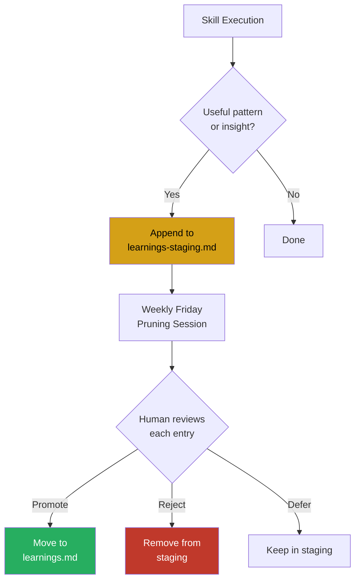

# Self-Improving Skills

## Concept

Self-improving skills accumulate learnings over time, becoming more effective with use. This is a governance-controlled process — not autonomous self-modification.

## Governance Model: Option A (Fully Manual)

The framework currently uses the most conservative governance option: fully manual, human-in-the-loop control over all learnings.



## How It Works

Each self-improving skill contains three files:

| File | Purpose | Max Size |
|------|---------|----------|
| `SKILL.md` | Skill definition and workflow | 500 lines |
| `learnings.md` | Active learnings that influence execution | 50 lines |
| `learnings-staging.md` | Proposed learnings awaiting human review | No limit |

### Adding a Learning

After each execution, if a pattern or insight would improve future executions, the skill appends it to `learnings-staging.md`:

```
- [YYYY-MM-DD] [pattern/insight] — [context where it applies]
```

The skill never modifies `learnings.md` directly.

### Weekly Friday Pruning

During the weekly pruning session, the human:

1. Reviews each entry in `learnings-staging.md`
2. **Promotes** valuable learnings to `learnings.md`
3. **Rejects** learnings that are not useful
4. **Defers** learnings that need more evidence

The 50-line cap on `learnings.md` enforces quality over quantity — only the most valuable patterns survive.

## Pilot Skills

Two skills currently participate in the self-improving governance:

### architecture-review

Captures patterns from architecture reviews: recurring compliance issues, common structural problems, effective design patterns observed across projects.

### client-deliverables

Captures preferences from C-Suite deliverables: formatting feedback, terminology preferences, successful presentation structures, client-specific patterns.

## Governance Options (Reference)

The framework defines three governance options with increasing autonomy. Only Option A is currently active:

| Option | Autonomy | Status |
|--------|----------|--------|
| **A: Fully Manual** | Human reviews and promotes all learnings | Active (current) |
| B: Semi-Automated | Agent proposes, human approves batches | Defined, not implemented |
| C: Fully Automated | Agent manages learnings with audit trail | Deferred pending pilot results |

The progression from A → B → C is intentional. Trust is earned through demonstrated governance discipline, not assumed.
