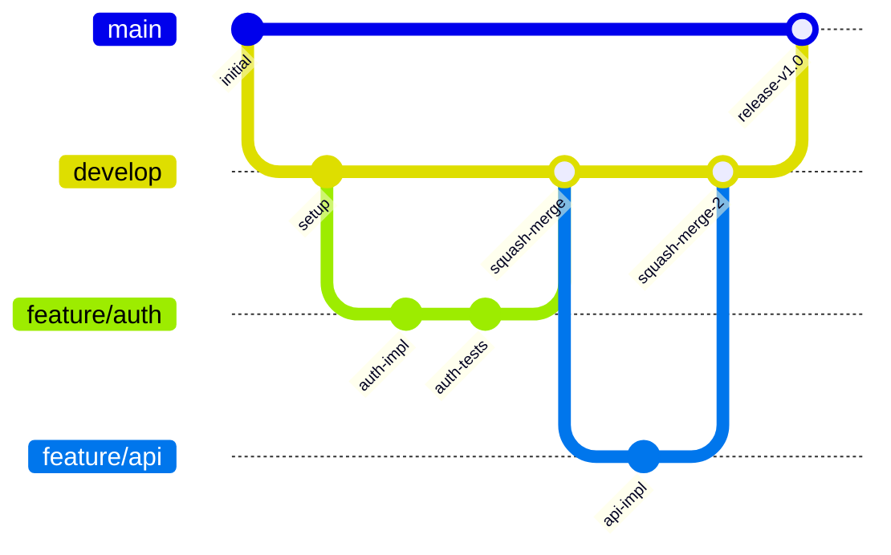

# Git Workflow Standards

**Version:** 1.0 | **Status:** Active Standard

## Branch Strategy



```
main                    # Production-ready code
├── develop             # Integration branch
│   ├── feature/*       # Feature branches (agent-created)
│   ├── fix/*           # Bug fix branches
│   └── experiment/*    # Experimental branches (safe to discard)
└── release/*           # Release candidates
```

## Commit Conventions

Format: `type(scope): description`

**Types:** `feat`, `fix`, `refactor`, `test`, `docs`, `chore`, `security`

All agent-generated commits include:

```
Co-Authored-By: Claude Opus 4.6 <noreply@anthropic.com>
```

## Branch Protection

Required for `main` and `develop`:

| Rule | Setting |
|------|---------|
| Direct commits | Blocked (PR required) |
| Review approvals | At least 1 |
| CI checks | Must pass |
| Security review | Sentinel must pass |

## PR Standards

- Title under 70 characters
- Description includes: summary, changes made, testing performed
- Link to related issues
- No draft PRs sitting for more than 5 business days without activity

## Merge Strategy

| Merge Path | Strategy | Rationale |
|-----------|----------|-----------|
| feature → develop | Squash merge | Clean history |
| develop → main | Merge commit | Preserve feature boundaries |
| fix → main | Cherry-pick | Hotfixes, then merge back to develop |
