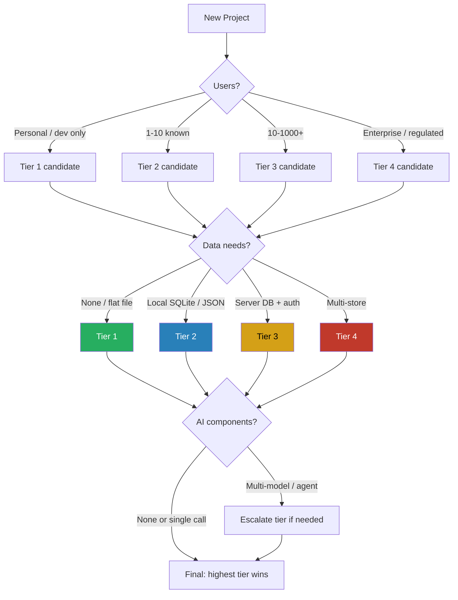
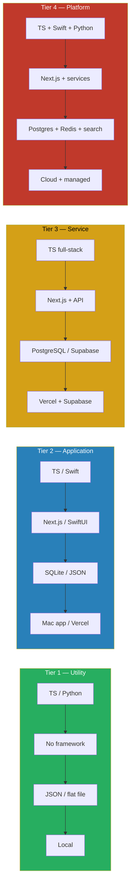

# Project Complexity Classification

**Version:** 1.0 | **Status:** Active Standard | **ADR:** [ADR-007](../architecture/decisions/ADR-007-project-complexity-classification.md)

## Decision Flowchart

!!! tip "Highest Factor Wins"
    The highest tier triggered by any single factor becomes the project tier. A project with 5 users (Tier 2) but SOC 2 compliance (Tier 3) is classified as Tier 3.

## Tier Summary

| Tier | Name | Examples | Stack |
|------|------|----------|-------|
| 1 | **Utility** | CLI tools, scripts, automations, experiments | TS/Python, no framework, JSON/flat file |
| 2 | **Application** | Mac app, internal tool, MVP, small web app | Next.js or SwiftUI, SQLite or JSON |
| 3 | **Service** | SaaS, client portal, multi-user API, AI service | Next.js + Supabase/Postgres, OpenAPI |
| 4 | **Platform** | Enterprise system, multi-service, regulated | Full stack + managed services + compliance |

## Technology Stack by Tier

## Execution Strategy Matrix

| Strategy | Tier 1 | Tier 2 | Tier 3 | Tier 4 |
|----------|--------|--------|--------|--------|
| **Direct coding** | Primary | Primary | Isolated tasks | Hotfixes only |
| **RALPH loop** | For single-file iteration | For feature implementation | For PRD-driven features | For bounded subsystems |
| **Spec-Driven Development** | Not needed | Optional | Recommended | Required |
| **AutoResearch** | Not applicable | Prompt/config optimization | Performance tuning | Systematic optimization |
| **NemoClaw** | N/A | N/A | Nvidia clients (eval) | Enterprise (eval) |

## Governance by Tier

| Governance | Tier 1 | Tier 2 | Tier 3 | Tier 4 |
|------------|--------|--------|--------|--------|
| Security profile | Professional | Professional | SOC 2 (if client) | Per requirement |
| Agents | Single | Single or Larry + 1-2 | Larry + specialists | Full orchestrator-worker |
| Code review | Self | Self or 1 reviewer | PR + 1 approval | PR + 2 approvals |
| Testing | Manual | 80% unit coverage | Unit + integration + E2E | Full suite + security |
| RSP gates | None | Threat model (if AI) | Full lifecycle | Full + audit trail |

## Data Layer Decision

| Scenario | Choice | Rationale |
|----------|--------|-----------|
| No persistence | In-memory / flat file | Zero overhead |
| Local Mac, single user | SQLite | Apple-native, zero-config |
| Simple web, <100 records | JSON objects | No DB overhead |
| Web app + auth + multi-user | PostgreSQL via Supabase | Managed, scalable, auth included |
| Enterprise + caching | PostgreSQL + Redis | Persistence + performance |

## Tier Escalation

Projects escalate when any factor crosses the tier boundary. When escalating: update project CLAUDE.md, apply new tier defaults, document the trigger.

For the full operational standard, see `framework/standards/project-complexity.md`. For decision rationale, see [ADR-007](../architecture/decisions/ADR-007-project-complexity-classification.md).
