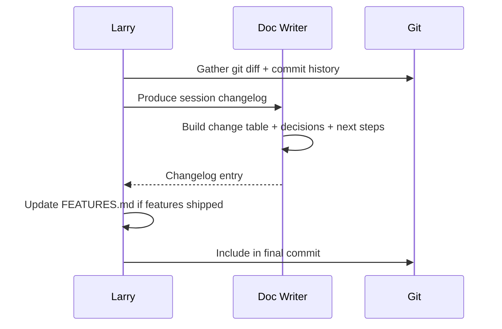

# Session Documentation Standard

**Version:** 1.0 | **Status:** Active Standard

## Purpose

Git history captures raw commits but is not scannable for "what does this project look like today" or "what changed in this session." Every development session must produce structured documentation. This is a mandatory step in Larry's workflow (step 9), not optional.

## Session Changelog

At the end of every session, Larry invokes Doc Writer to produce a changelog entry appended to `CHANGELOG.md` (newest first).

### Changelog Format

| Field | Content |
|-------|---------|
| **Summary** | 1-2 sentence description of session accomplishments |
| **Changes table** | Each change with files modified and status (Shipped / In Progress / Reverted) |
| **Decisions** | What was decided, why, and ADR reference if applicable |
| **Backlog updates** | Items added, reprioritized, or completed |
| **Known issues** | Issues introduced or discovered |
| **Next session** | What to pick up next |

### Example

| Change | Files | Status |
|--------|-------|--------|
| API key validation with green/red indicators | SettingsView.swift | Shipped |
| Keychain rewrite — removed biometric ACL | KeychainService.swift | Shipped |
| Request Author button on CEO's Authors screen | AuthorListView.swift | Shipped |
| Insight of the Day seeded PRNG randomization | DashboardView.swift | Shipped |

## Feature Inventory

Every project maintains `FEATURES.md` in the project root — a living document answering "what does this project do today?"

### Sections

| Section | Tracks |
|---------|--------|
| **Implemented** | Feature name, description, date shipped, key files |
| **In Progress** | Feature name, description, target date, blockers |
| **Planned** | Feature name, description, priority, dependencies |

### Update Rules

- Doc Writer updates FEATURES.md when features ship, start, or are planned
- Every implemented feature must have date shipped and key files
- Removed features noted in the session changelog, then deleted from FEATURES.md

## Framework-Level Documentation

For changes to the framework itself (not project-specific):

| Document | Location |
|----------|----------|
| Session changelog | `framework/evolution/CHANGELOG.md` |
| Feature inventory | `framework/BACKLOG.md` |
