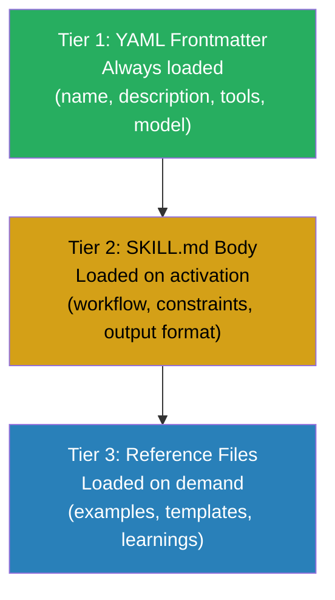

# Skill Building Standards

**Version:** 1.0 | **Status:** Active Standard | **ADR:** [ADR-004](../architecture/decisions/ADR-004-skill-building.md)

## Size Constraints

| Metric | Target | Hard Maximum |
|--------|--------|-------------|
| SKILL.md lines | 200 | 500 |
| Description length | 3 parts | 3 parts |
| Reference files | As needed | No limit |

## Progressive Disclosure Architecture

Skills use a three-tier loading model to manage context efficiently:



**Tier 1 — YAML Frontmatter:** Always loaded by Claude Code for routing decisions. Contains name, description, tools, and model. The description field uses a three-part framework: trigger keywords, negative triggers, and outcome statement.

**Tier 2 — SKILL.md Body:** Loaded when the skill activates. Contains workflow steps, constraints, and output format. Target: 200 lines maximum.

**Tier 3 — Reference Files:** Loaded on demand during execution. Contains examples, templates, learnings, and supplementary material. Stored in `references/`, `scripts/`, or `assets/` subdirectories.

## Description Framework

Every skill description includes three parts:

1. **Trigger keywords** — When this skill should activate
2. **Negative triggers** — When this skill should NOT activate (prevents misrouting)
3. **Outcome statement** — What the skill produces

## Skill Directory Structure

```
skills/
└── skill-name/
    ├── SKILL.md              # Primary skill definition (Tier 1 + 2)
    ├── references/           # Tier 3 reference material
    ├── scripts/              # Automation scripts
    └── assets/               # Templates, examples
```

## Self-Improving Skills

Two pilot skills use human-gated learnings governance (Option A: fully manual):

- **architecture-review** — Captures patterns from architecture reviews
- **client-deliverables** — Captures preferences from C-Suite deliverables

See [Self-Improving Skills](../skills/self-improving.md) for governance details.

## Evaluation-Driven Development

Skills are developed and refined using Anthropic's evaluation pattern: define assertions, run test cases, measure quality, iterate. The skill-creator meta-skill provides tooling for A/B testing reference files and benchmarking skill performance.

## Common Patterns

| Pattern | Use Case |
|---------|----------|
| Template | Structured output with fill-in sections |
| Examples | Few-shot learning from annotated examples |
| Conditional workflow | Branch based on input classification |
| Feedback loop | Iterative refinement with quality checks |

## Anti-Patterns

| Anti-Pattern | Fix |
|-------------|-----|
| Monolithic SKILL.md (>500 lines) | Split into SKILL.md + reference files |
| Vague description | Apply three-part framework |
| Hardcoded assumptions | Use conditional logic or configuration |
| No negative triggers | Add explicit exclusion criteria |
